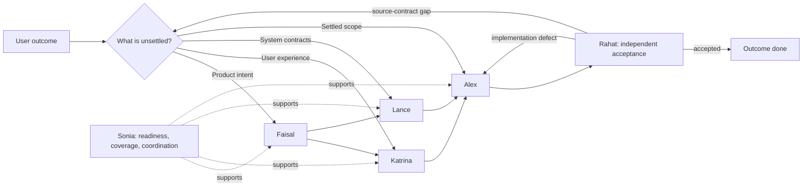

# BMILD

*Big Methods, Ideally Less Drama*

<!-- bmild-version-badge -->

[](https://github.com/micfre/BMILD/actions/workflows/ci.yml)
[](https://github.com/micfre/BMILD/actions/workflows/release.yml)
[](LICENSE)

> [!TIP]
> **Dev has moved from Slice-first to outcome-first!** Ask Alex to implement an approved phase/outcome directly; a Sonia planning session is optional. Bring Sonia in when readiness, requirement coverage, meaningful dependencies, or delivery strategy need attention. Alex owns and revises the internal decomposition inside the authorized MVP/Growth/Vision boundary. Ask Alex to **implement and verify** when you also want fresh-context independent review from Rahat in one-step. Existing Slice records remain as historical inputs -- there is no need to migrate them or create a new Slice first.

BMILD is a small cross-functional team for your coding agent. It gives the agent durable roles, a shared working memory, and a way to move from an idea to verified code without turning your project into an Agile reenactment.

Copy a handful of skill folders into your project. Talk to a persona when you need one. The work and its decisions live in normal Markdown beside your code. There is no service to run, no installer, no proprietary mediation layer. As the name suggests, there is also no prescribed ceremony to perform.

BMILD is for people who want the useful parts of spec-driven development: clearer intent, implementable decisions, adaptive execution, real verification, and a record of why things are the way they are.

## First two minutes with BMILD

1. Put the `bmild-*` skill folders where your agent discovers skills.
2. Start your IDE or CLI and talk to one of the personas, most likely the first one you interact with will be Faisal, the BMILD PM.

- Start where you actually are, not at a prescribed workflow starting point. For example: `Faisal, help me frame a feature for team invites.`
- Let the relevant persona write a spec into an artifact and hand you to the next owner when there is one.
- Ask Alex to implement an approved phase/outcome directly. Sonia helps with readiness, coverage, and consequential dependencies; a Slice plan is not a prerequisite.
- Alex chooses and revises the engineering approach within the spec's MVP/Growth/Vision boundaries. For build-and-verify, Rahat reviews in a fresh independent context and authorized repairs return to development before re-verification.
- If the work changes, BMILD resolves affected owner decisions in-session where capability permits, marks only unresolved artifacts stale, and keeps any genuinely asynchronous handoffs precise. You do not need to hold the dependency picture yourself.

That is the whole idea: retain context and judgment while keeping the interaction human and direct.

## Locations and initial steering

BMILD is skill-native. Copy the folders from this repository into the skills directory for the repository you want to work in. You can vendor them, use a symlink, or distribute them through your normal team setup.

```sh
mkdir -p .agents/skills
cp -R /path/to/BMILD/.agents/skills/bmild-* .agents/skills/
```

Skill locations for harnesses are:

- **Codex:** `.agents/skills/`
- **Claude Code:** `.claude/skills/`
- **OpenCode:** `.opencode/skills/`

Then open your project with a capable coding model and say one of these things:

```text
Faisal, help me frame a feature for team invites.
Katrina, design the experience for the existing billing settings.
Rahat, diagnose this failing CI test.
Rahat, independently review the team-invites MVP in a new context.
Alex, implement and verify the approved MVP for team-invites.
```

There is no required “start BMILD” command. Calling the persona by name is the best way to activate them (their names aren't just ornamentation, they are unique calling cards which activate the skills). A persona looks at the available context and the state of the work, then takes the appropriate approach. If you have an existing project and a specific problem, say so. If you have a vague idea, say that instead.

When in doubt, ask them. They know their own roles and modes, as well as those of the rest of the team.

### First day with BMILD

The first day should feel practical, not like onboarding for a project-management tool. You should feel progress almost right away.

- **Starting something new?** Ask Faisal to frame it. He helps establish the problem, users, scope, success criteria, and the first version of the requirements. Faisal will both help with and force decision-making where needed, he will guard against solutioning at this stage.
- **Do not know what the project should do next?** Ask Faisal for a bearing. He grounds the project against its live initiatives, gives you a small set of load-bearing directions, recommends one with its overturn conditions, and can continue directly into the appropriate initiative workflow after you choose.
- **Already have direction?** Go straight to Katrina for interaction design or Lance for architecture. BMILD does not make you recreate a product brief just to earn permission to discuss an API.
- **Ready to implement a written spec?** Ask Alex to implement and verify the approved phase/outcome. Alex checks sufficient readiness, uses Sonia for unresolved completeness questions, and preserves committed design constraints.
- **Already have a plan or old Slices?** They remain useful context. Alex can execute the authorized outcome without re-planning it into Slices or selecting one merely because several exist.
- **Fixing a bug or an awkward old area?** Start with Rahat. The point is to establish a cause and evidence before changing code, not force a greenfield process onto a maintenance task. Rahat is skilled with a breadth-first RCA approach; after confirmation, choose whether Rahat implements the fix or hands a context-rich RCA to Alex.
- **Facing a real trade-off?** Ask for a Roundtable, or use Elicit to push a draft past its first plausible answer. You still make the call. Advanced elicitation modes are a real antidote to LLM sycophancy and goal-seeking behaviour.

By the end of the first day using BMILD, you should have a small body of project memory that an agent can re-enter tomorrow: the current problem, a few decisions, what is live, what is stale, and what comes next. You do not need every artifact for every piece of work. If you forget where you left off, just ask Sonia, she knows.

## A good default `.bmild.toml`

`.bmild.toml` is optional. To create preferences, create and save it at the project root. With no file, BMILD uses sensible defaults and stores its working memory in `plans/`. Adding this small version early is enough for most projects:

```toml
user_name = "Developer"
plan_folder = "plans/"
gap_resolution = "auto"
```

- `user_name` lets the named personas address you naturally. It is a small thing, but it makes a long working session less anonymous, and most models don't overuse it.
- `plan_folder` is where BMILD keeps its memory and project artifacts, relative to the repository root. Leave it as `plans/` or anywhere else if you have a reason to keep generated project memory elsewhere.
- `gap_resolution` controls whether owner consults run automatically, ask first, or leave the session. `auto` is the default and keeps mechanical/eligible owner resolution in-session.

## About automated commits

The default is `commit = 0`: Alex and Rahat make no commit and do not prepare a commit message. The following is a safe starting point when you want to make the behaviour explicit:

```toml
commit = 0                        # 0: off; 1: message + eligible local commit; 2: message only
# format = "conventional-commits" # omit to infer local history, then fall back here
branch = "current"                # current | initiative
```

Use `commit = 2` when you want Alex or Rahat to prepare a message without changing Git state. Use `commit = 1` when you want at most one eligible local commit after successful, attributable work. In either mode, repository and harness guidance can only reduce that authority (this means that if for example AGENTS.md forbids an LLM to commmit, BMILD will respect that and not override it.). With posture `1`, BMILD preserves unrelated changes, uses normal hooks, and commits only the paths that persona changed in that invocation. If the state is unsafe, incomplete, blocked, or cannot be cleanly attributed, the result falls back to message-only. Session closes report posture compactly: a successful commit is one hash/subject/branch line; message-only work fences the proposed message; failures and non-ready work state a short reason without a field dump.

Set `format = "conventional-commits"` for that explicit message style [q.v.](https://www.conventionalcommits.org/en/v1.0.0/); otherwise Alex or Rahat makes a bounded attempt to infer the local convention before falling back to it. Keep `branch = "current"` to stay on your selected branch. Use `branch = "initiative"` only when you want eligible commit work to use the kebab-case initiative branch name and when you understand that a clean worktree is required for any switch or creation.

> [!WARNING]
> Automated commit posture is deliberately local-only. It never fetches, pulls, pushes, opens a pull request, stashes, amends, rebases, resets, bypasses hooks, or rewrites history.

### About automatic gap resolution

The default is `auto`: when a persona finds a gap owned elsewhere, it suspends the current step, runs a skill-native resolution ladder, and resumes after re-reading the changed contract. The ladder uses simplified mechanical scribing first, then authorized owner voice, then an owner consult. A durable `H-###` is created only when work truly leaves the session; Course-Correction is reserved for coupled scope, sequencing, or proof changes and requires your approval.

```toml
gap_resolution = "auto" # auto (default) | ask-consult | handoff-only

[intelligence.claude_code.design]
model = "opus"
effort = "max"

[intelligence.codex.design]
model = "gpt-5.6-sol"
effort = "ultra"
```

The intelligence tiers are `design` (Faisal, Katrina, Lance), `planning` (Sonia), `implementation` (Alex), and `reviewer` (Rahat). Claude Code and Codex accept optional native model/effort pairs per tier. All unspecified tiers inherit the user-selected session model and effort. Explicit owner-dispatch overrides remain binding; BMILD does not rank model names or require exact-model attestation for authorized in-session judgment. OpenCode always inherits the user's harness-wide model and variant and ignores BMILD tier overrides.

`ask-consult` pauses only before the consult rung. `handoff-only` still allows mechanical scribing but sends owner judgment to the durable queue. Legacy `consult`, `consult_model`, and `consult_effort` keys are rejected with migration guidance; BMILD never maps them silently. An invalid explicit model/effort pair is reported exactly once, is never retried or substituted, and leaves one durable handoff for that affected episode.

Consult agents are leaves. Owner consults may author anything they canonically own, including `DESIGN.md`, `context-map.md`, and ADRs. Release tarballs carry current definitions for Claude Code, Codex, and OpenCode under `harness/`; `scripts/generate-consult-agents.sh` regenerates them locally.

### Outcome execution and continuity

Outcome Development is the primary spec-backed path. The outcome section in `verification-matrix.md` records phase authorization, source requirements, implementation evidence, open obligations, and independent review. Alex owns task order and internal structure; forecasts and file inventories are not contracts. Sonia checks intent and coverage; Rahat checks correctness, completeness, security applicability, standards/spec fidelity, and relevant scalability and maintainability.

Faisal's PRD maps stable requirement and journey IDs to phase outcomes; describing Growth or Vision does not authorize either phase. Katrina scopes binding UX to the authorized outcome while preserving initiative-wide interaction invariants. Observable behavior and applicable states bind implementation, while standard component mechanics may remain Alex's choice under established design conventions.

A build-and-verify engagement can continue across contexts without user relays. Review requires a fresh context that did not implement the change or inherit its development transcript. You can explicitly choose a separate new review window. Where automatic isolated dispatch is unavailable, BMILD leaves acceptance pending and provides a concise transition grounded in artifacts. A reviewer-authored production fix needs another independent reviewer before acceptance. Review-only requests do not authorize production fixes.

## Why BMILD is different

### It is not a scripted workflow

BMILD has a common arc: frame, design, implement, independently verify—with planning when readiness or coordination benefits from it. It is a map of ownership, not a funnel. Personas activate from the state of the work and the artifacts already present.

That matters in real repositories. Greenfield work may begin with product framing. Brownfield work may begin with a failing test, an undocumented architectural constraint, or a half-finished feature that needs a careful re-plan. You can run any number of initiatives in parallel. Each has its own folder and live artifact registry, while shared meaning and durable cross-project decisions remain visible at the project level.

It also adapts to you. If you want help finding the questions, the design-tier personas probe and slow the agent down where the stakes are real. If you already know the decision, say it; the persona captures its consequences rather than making you sit through a performance of clever discovery. BMILD is meant to provide judgment and structure where they help, not to demand a ritual before useful work can start.

### It organizes execution around outcomes

Epics, stories, sprints, and points were built to coordinate people and forecast human capacity. They can be useful in their setting. They are not a natural unit of work for a coding model.

BMILD uses an **initiative** for a coherent piece of product or system work. Execution targets an authorized **phase/outcome**, with source requirements and demonstrable acceptance. The agent chooses useful internal work units; existing Slice records remain optional historical context.

This is the central design choice in BMILD. The framework keeps authorized scope, governing contracts, and proof obligations explicit while leaving internal decomposition to the executor. You can still use your existing issue tracker, sprint cadence, or team rituals if they serve people on your team. BMILD simply does not mistake them for the coding agent’s unit of work.

### It treats artifacts as working contracts

The memory is plain Markdown, but it is not a chat transcript. Each meaningful document has an owner, consumers, and usually a verifier:

- product and requirements documents capture intent and priority;
- UX and system-design documents make the experience and technical contracts concrete;
- outcome evidence records connect authorized scope to implementation, continuation state, and independent proof;
- RCA and security-review artifacts keep confirmed failures and findings from becoming scattered knowledge.

BMILD can work from either greenfield or in a brownfield environment. BMILD is designed to groundtruth at every stage, it will not -- or rather tries hard not to -- write a beautiful spec document that collides with existing code reality that it never thought to look for.

### It assumes specifications will drift

Plans change. Implementation reveals constraints. A product decision invalidates UX or architecture work. A decision made in chat is easy to lose. BMILD treats this as a normal day.

- `registry.md` identifies which initiative artifacts are **live**, **archived**, or **stale**, so a persona does not confidently build against superseded guidance.
- `context.md` keeps initiative-local terms, boundaries, and resolved ambiguities. `context-map.md` carries the cross-initiative version of that shared meaning.
- A decision goes into an ADR only when it is hard to reverse, surprising without context, and the product of a real trade-off. Active rationale stays where the work happens; the ADR protects the decisions future maintainers are most likely to “fix” by accident.

When a change affects multiple design owners, Sonia’s course-correction mode handles user-authorized coupled scope/contract/proof changes; ordinary execution-plan revisions stay with Alex. It is re-planning without throwing away the context that made the original plan useful.

### It closes ownership gaps before handing off

When an agent raises a conflict or gap, BMILD first tries to close it in the same session and resume the original work. A handoff appears only when required capability or user input is unavailable, authority is declined, or ownership must genuinely continue later.

A handoff is not “someone else’s problem now.” It is a precise asynchronous request: what changed, why it matters, what capability or decision is missing, the exact source document, and the condition for resuming suspended work. The handoff remains coordination history, never a competing source of truth.

This is a major part of how BMILD contains spec drift. Decisions and unresolved questions do not hang indefinitely in an ever-expanding chat log, where a later session can miss or reinterpret them. A resolution lands in the artifact that governs the work; its downstream consumers are then classified as unaffected, needing a minor update, or stale. Larger cascades go to Sonia for course-correction.

> [!NOTE]
> A handoff is for work that genuinely leaves the session. Settled reversible facts and authoritative statuses are propagated mechanically without loading another persona's voice. A causally bounded single-owner decision may be authored through authorized owner voice or an owner consult. All in-session paths record provenance beside the authoritative edit; they do not create a closed handoff merely for history.
>
> Advanced facilitation adds one more connective tissue: after a ratified durable-contract decision, independent owner consequences return through separate ladder episodes. Coupled fallout offers Sonia's Course-Correction once and waits for consent. Agreement in chat is not organizational truth until the owned artifacts or a genuinely asynchronous backlog reflect it.

This makes BMILD particularly comfortable for work that crosses sessions, agents, or people. It gives continuity without pretending that the system can make unresolved decisions on your behalf.

## The team

BMILD has six standard personas and three interactive modes. They are deliberately opinionated about their own responsibilities, but they are not a chain of approval gates.

- **Faisal 🟦 -- Product Manager:** frames the problem, users, scope, success criteria, and requirements; at project scope, he can recommend the next load-bearing direction. Useful when the “why”, “what”, or “what next?” is still blurry.
- **Katrina 🟩 -- UX Designer:** owns information architecture, flows, states, interaction rules, and the experience people will actually have.
- **Lance 🟫 -- Architect:** separates initiative-wide invariants from outcome-specific architecture; commits load-bearing boundaries, quality, data, integration, failure, and evolution constraints while leaving reversible implementation choices to Alex.
- **Sonia 🟧 -- Delivery Planner:** checks whether a design is ready to build, creates verification coverage, checks phase/outcome completeness and proof, and advises on meaningful dependencies when needed.
- **Alex 🟪 -- Developer:** implements approved phase-bounded outcomes, bounded direct work, and fixes while respecting the project’s existing code and durable memory.
- **Rahat 🟨 -- Quality & Reliability:** owns the complete independent review loop: outcome FR/NFR and completeness verification, high-confidence security review, and code review against repository standards and the governing specification. Ask for a **comprehensive review** to run all three from one context load and accept the outcome in the same pass when every axis is clear. Rahat also diagnoses before fixing and records durable RCAs. Existing repair authority or Fix Election permits a bounded fix, whose acceptance then belongs to another independent review context.

The three interactive modes are available whenever they help. A persona may suggest one when the work would benefit from wider options, a stress test, or cross-functional trade-offs; you can also ask for one directly at any time. The calling session is suspended, not discarded, so the original persona resumes with the facilitator’s output and does not re-ask what you have already settled.

- **Brainstorm:** expands the option space before convergence.
- **Elicit:** strengthens a draft through structured questioning and challenge.
- **Roundtable:** brings the relevant perspectives to table, makes trade-offs visible, and leaves the decision with you. (Legacy note: `Debate` remains a valid trigger and `Party Mode` works, too.)

## What the work looks like



The workflow is intentionally non-linear. You might start at Alex for a bounded direct-dev request or spike. Rahat may diagnose a failure and then either implement the confirmed fix or hand the RCA to Alex when you want a fresh window. Rahat may also surface a design flaw that needs Lance. An existing UX design may be enough to ground the next authorized outcome. Sonia may send a change upstream rather than papering over a gap. The important part is that the next move is based on the state of the work, not which box you were supposed to visit first. Agents are good about calling out next moves, if in doubt.

### Readiness and independent acceptance

Readiness checks whether the authorized outcome has coherent intent, usable constraints, and demonstrable completion criteria. Alex can apply the same criteria in execution; Sonia can lead a dedicated assessment when useful. A missing document filename does not block an otherwise sufficient contract. A real product or security ambiguity does. Independent authorized work can continue while a different obligation is blocked.

Rahat checks the original spec rather than trusting only the matrix or Alex's tests. Every required review axis needs current evidence. Security `not_reviewed`, an omitted axis, or a passing test run without independent review cannot close an outcome. Relevant performance assumptions and maintainability are reviewed explicitly; unverified limits stay visible.

### Optional artifact review, and how code review gets its teeth

Sonia can run the optional **Artifact Reviewer Gate** over a live `prd.md`, `ux-design.md`, or `system-design.md` — an explicit, opt-in quality review, offered (never required) by Faisal, Katrina, and Lance when they finalize an artifact. Each baseline lens (an eight-dimension quality rubric plus an adversarial lens) runs in an isolated reviewer context that writes a full findings file and returns only a compact summary; Sonia consolidates into one overall result — `clear`, `findings_open`, or `incomplete` — with severity-ranked findings the artifact owner dispositions as `apply`, `discuss`, `defer`, or `ignore`. The result describes artifact quality only: it is not outcome readiness, not implementation authorization, and never a QA status. When isolated reviewers are unavailable, the run reports `incomplete` with continuation prompts for a fresh session rather than quietly approving anything.

Rahat's code review, comprehensive review, and targeted verification apply two mechanical depth lenses. **Edge-Case Hunter** traces every branch and domain boundary — including implicit branches (the untouched members of a changed fixed set), handle lifetimes, call-site/callee mismatches, deletion effects, and author claims read strictly after the path trace — reporting unhandled paths as `location / trigger_condition / guard_snippet / potential_consequence`. **Verification-Gap** asks one question — if the behavior this change should produce broke where it's actually used, would verification fail? — and classifies regression, missing-adoption, and broken-verification gaps from tests actually read and repository searches actually run. Every lens and reviewer claim is then verdicted through findings triage: verify the claim and its reachable consequence before assigning `high | medium | low | false | maybe-false`, group survivors by root cause, and warn on failed layers instead of issuing a false clean review.

### Context has a cost

BMILD uses more tokens than asking an agent for a one-shot patch. It spends them on role instructions, durable artifacts, and the evidence needed to make a decision or verify a result. That is intentional: the framework trades some up-front context for fewer rediscovered decisions, less drift, and less code built on an invented interpretation.

It manages that cost through progressive disclosure [q.v.](https://agentskills.io/specification#progressive-disclosure) rather than loading the whole project memory every turn. The compact core skill selects the active mode; detailed mode instructions load only when that mode needs them. Personas load the relevant **live** artifacts for the named initiative and task, not archived or stale material and not unrelated initiative folders.

There is an important safety exception. UX and Architecture may reuse artifact contents already visible in the conversation when they are still trustworthy, and the advanced modes prefer the current conversation unless files are needed to ground the question. Planner and Rahat deliberately reload relevant live artifacts from disk because stale planning, verification, code-review, or security context can do more damage than the extra tokens. In other words, BMILD optimizes context in a sensible way while not pretending it's free.

### A 71-method elicitation bench, served on demand

Advanced elicitation draws from a canonical catalog of 71 methods — the full BMAD-METHOD 6.13 bench, with BMILD's differentiation intact: methods that cast named personas (Stakeholder Round Table, Expert Panel Review, Cross-Functional War Room, Security Audit Personas) load each persona's canonical `SOUL.md` rather than facilitator-invented voices. The catalog is consumed through a skill-local serving script (`bmild-elicit/scripts/methods.sh` on POSIX hosts, `methods.ps1` on Windows), so a session sees category names and counts first, compact index rows for at most two candidate categories, complete records only for the one primary and up to three follow-up methods it actually selects, and a category-spread reshuffle draw bounded to twelve candidates that never repeats what was already offered. The complete catalog enters context only on an explicit list-all choice; if serving fails mid-session, the facilitator halts selection and a full-catalog fallback happens only with the operator's explicit approval.

The method **numbers are intentionally breaking**: version 0.5.0 renumbered the catalog to match BMAD-METHOD 6.13 order exactly (Tree of Thoughts is 1 again, First Principles Analysis is now 24, Boundary & Edge Case Sweep is 71). Old numbers receive no aliases; **method names are the cross-version reference**.

### Deterministic PRD linting before registration

LLMs miscount IDs and miss literal placeholders; a script does not. Faisal's PRD write and refine paths now run a deterministic pre-registration lint gate (`bmild-pm/scripts/lint-prd.sh` on POSIX, `lint-prd.ps1` on Windows) over the candidate PRD: placeholders, frontmatter defects, duplicate or discontinuous FR/journey IDs, unresolved phase references, malformed assumption entries, and missing documentation-audience decisions, reported as one exact JSON object (`bmild-artifact-lint/v1`, ruleset `prd-v1`) with rule, severity, and source line for every finding. High- and medium-severity findings block registration; the reported SHA-256 identity binds the checked candidate to the exact bytes Faisal registers, and the gate re-runs after any change. This is an owner-governed workflow convention — the linter never edits anything and nothing is filesystem-enforced; it converts a class of silent mechanical defects into deterministic catches while semantic judgment stays with the responsible persona.

### Journeys that carry evidence, decisions that name their cost

A journey in a BMILD PRD is applicability-gated, not mandatory: Faisal writes one when requirements involve user-facing behavior or workflow change, and records why no journey applies for purely technical work — no placeholder journeys. When one applies, Faisal asks for a real session first (a named person, the moment value landed, what went wrong) and shapes only what you supplied into protagonist, inline context, ordered path, climax, success exit, and failure path. Journeys built from a confirmed account are labeled **Firsthand**; when no account exists, Faisal offers a clearly labeled **Illustrative** journey and records the specific evidence gap — a well-written example never quietly becomes an observation, and the label survives Katrina's translation into UX flows. Every success metric Faisal records — in a brief or a PRD — is paired with a **counter-metric** naming the harmful way the primary number could be gamed.

The same sharpening runs through design. Lance's drift-protection ADRs carry a **Prevents** line naming the concrete divergence a future "fix" would cause (a `Prevents` that restates the decision is rejected), and system designs close with a **structural dimension sweep** — every applicable dimension decided, deferred with a reason, or an explicit open question, with the operational envelope (deployment, environments, infrastructure, operations) no longer able to stay silently absent. Katrina's UX contracts check references before usefulness: `DESIGN.md` tokens are cited by resolvable `{path.to.token}` name (an unresolved token is surfaced, never invented), named components carry both a visual and a behavioral rule or a named inherited source, each in-scope surface walks its applicable empty / cold-load / error / offline / permission-denied states, user-facing needs and outcome surfaces close in both directions, and a mechanical coverage pass runs before the judgment pass.

The template layer's known condition is written down: [`docs/template-resource-audit.md`](docs/template-resource-audit.md) inventories all 70 `assets/` and `resources/` files across the nine skills, compares each against BMAD-METHOD 6.13 prior art and BMILD's own best-practice docs, and records fit verdicts with a ranked backlog. The audit is an assessment, not authorization — adopting any candidate is separately scoped follow-on work.

## Memory, without a platform

By default, BMILD writes its durable project memory under `plans/`. The paths are relative to the project root and are ordinary Markdown files with frontmatter, so the material stays portable and reviewable.

```text
<project-root>/
├── .bmild.toml                    # optional preferences
├── DESIGN.md                      # durable project-wide UX patterns
└── plans/                         # or your configured plan_folder
    ├── context-map.md             # cross-initiative concepts and boundaries
    ├── rollup.md                  # initiative index, current bearing, status, decision log
    ├── adr/                       # selected durable decisions
    └── <initiative-name>/
        ├── registry.md            # live, archived, and stale artifacts
        ├── context.md             # local terms, boundaries, ambiguities
        ├── product-brief.md
        ├── prd.md
        ├── ux-design.md
        ├── system-design.md
        ├── handoff.md
        ├── verification-matrix.md
        ├── slices.md and slice-<N>.md  # legacy records, optional
        ├── rca-<slug>.md
        └── security-review-<slug>.md
```

An initiative is an atomic body of work, not an Agile epic. Its name is a confirmed lowercase kebab-case identifier, such as `team-invites`. `registry.md` is the initiative’s entry point: it tells a returning persona which documents are current and which have been made stale by an upstream change.

### Works with existing standards

BMILD keeps project-wide UX patterns in root-level [`DESIGN.md`](https://github.com/google-labs-code/design.md), aligned with Google’s design document convention. Katrina distils a pattern there only when it applies beyond one initiative; initiative-specific interaction decisions stay in `ux-design.md`.

The configured `plan_folder` is an [Open Knowledge Format (OKF)](https://github.com/GoogleCloudPlatform/knowledge-catalog/blob/main/okf/SPEC.md) bundle. Each BMILD memory artifact inside it is an OKF concept with standard YAML frontmatter first and BMILD workflow fields preserved alongside it; Markdown links make the whole spec corpus traversable. This is compatibility, not a platform dependency: BMILD works as plain Markdown whether or not an OKF consumer is present.

## Practical prompts

Use the role you need, in ordinary language. These are starting points, not special commands:

```text
Faisal, I have a rough idea for self-serve team invites. Help me decide what the MVP is.

Katrina, the invite flow exists but feels confusing. Design a better flow from the current repository context.

Lance, we need tenant-aware roles. Design the data and API contracts for it.

Sonia, check readiness and coverage for the approved team-invites MVP.

Sonia, run an artifact review of the live team-invites PRD.

Alex, implement and verify the approved MVP for team-invites.

Rahat, this intermittent invitation-email test is failing in CI. Diagnose it before changing code.

Rahat, security-review the invitation acceptance endpoint and its trust boundaries.

Rahat, code-review the team-invites MVP against repository standards and the specification.

Rahat, verify the FR coverage of the team-invites invitation expiry behavior.

Rahat, run a comprehensive review of the team-invites MVP in a fresh context.

Debate the question of whether invitations should expire.
```

You can name an initiative, point at a failing test, paste a decision, or say “I do not know where to start.” The personas should meet the work at that level.

## Compatibility and expectations

BMILD's first-class harness targets are Codex, Claude Code, and OpenCode. Release validation and generated consult packages cover those three only. Other harnesses rely on compatibility without additional BMILD design effort. Runtime development has no token-estimator interpreter dependency.

Use a capable coding model, design target is roughly anything in the top-15 SWE-bench Verified ranking (score > 66). BMILD relies heavily on the agent to make semantic distinctions. Better reasoning models will make more of the framework; a 3B parameter running locally will disappoint.

### Working beside other frameworks

BMILD grew out of [BMAD-METHOD](https://github.com/the-bmad-group/bmad) or more correctly my longtime use and appreciation of it, whose persona archetypes and interactive patterns were formative. The difference is one of operating model: BMAD runs a fuller Agile-with-AI approach; BMILD is artifact-led, and deliberately less prescriptive.

Do not install BMILD and BMAD skills side-by-side in the same project. They share trigger language and can make an agent select unpredictably.

### The whole package is the single product

BMILD consists of 9 skills, sibling support files and subfolders within those skills. There is no utility in a solitary skill or a subset of these skills. At least one skills aggregation and distribution site [q.v.](https://skillsmp.com/creators/micfre/bmild/agents-skills-bmild-pm) will index and offer skill downloads as one-offs -- don't attempt using the skills this way, BMILD will break.

### Removing BMILD

Remove the `bmild-*` folders from your skills directory, and the `.bmild.toml` file from project root if it exists. The Markdown memory remains in your project until you decide to delete it. There is no service, database, or hidden state to unwind.

## What to look at next

- You made it through the README, you're well on your way, great start.
- Browse [`.agents/skills/`](.agents/skills/) to see the skill folders that make up the framework.
- Read the `SOUL.md` in each persona folder to discover the point of view behind its role.
- Read [`AGENTS.md`](AGENTS.md) for the authoritative artifact map, ownership rules, memory layout, and governance details.
- Read [`.bmild.toml.example`](.bmild.toml.example) when you want the complete current set of configuration options.

## Roadmap

> [!TIP]
> **You are here: v0.5.** Outcome execution preserves phase scope and independent assurance while leaving engineering strategy to the executor. Comparative model/harness performance remains an ongoing evaluation obligation.

- [x] **v0.1**  --  Initial commit
- [x] **v0.2**  --  Persona scope stable
- [x] **v0.3**  --  Context memory structure stable
- [x] **v0.4**  --  Persona interactivity contracts
- [x] **v0.5**  --  Outcome-based development and independent acceptance

## Personal Note

### Who am I?

I am a career Product Manager, with many years in services and system development from mobile to Internet, with scope from UX to marketing on the consumer-facing side to rating and subscription in the backend and provisioning systems in the core. I have worked in waterfall and Agile environments, with teams that spanned time zones and continents. I have worked with some of the best system-minded people in the business. The names of the personas are picked from among these outstanding people.

### What do I get out of releasing it?

Simply, I built BMILD because it helps me with the work I am doing. It's fast, adaptive, effective and -- what is especially rewarding -- it's engaging and enjoyable to use. Yes, there are tens of thousands of projects like this, but there are definitely some novel ideas in here worth stealing if nothing else. Yours for the taking.

## Thanks

BMILD is built upon and inspired by:

- **[BMAD-METHOD](https://github.com/the-bmad-group/bmad)**: the persona archetypes and interactive patterns are adapted from BMAD.
- **[SOUL.md](https://github.com/aaronjmars/soul.md)**: informed the shape to get the most distinctive persona voices.
- **[Grill-with-Docs](https://github.com/mattpocock/skills/blob/main/skills/engineering/grill-with-docs/SKILL.md)**: the context and ADR log format is adapted from mattpocock's (wildly popular) skill.

All referenced materials are used in accordance with their respective MIT licenses.
